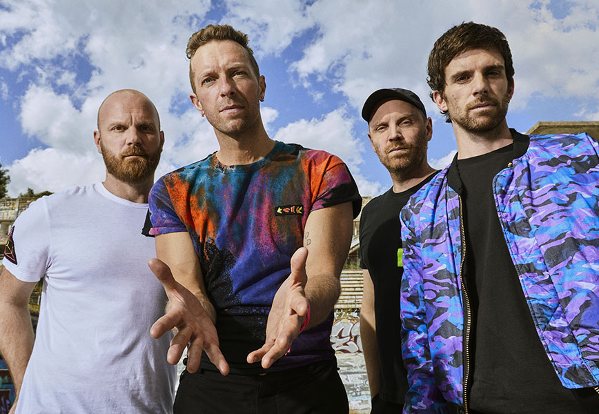

<h1 style="color: rgb(255, 69, 58);">Coldplay Lyrics</h1>
is a British rock band formed in 1996, known for their melodic sound and thought-provoking lyrics. The band consists of lead vocalist Chris Martin, guitarist Jonny Buckland, bassist Guy Berryman, and drummer Will Champion. Over the years, they have released numerous hit songs that resonate with fans worldwide.
<!--  -->

<h2 style="color: rgb(226, 171, 52);">Songs</h2>

1. A Sky Full of Stars (2014)
2. The Scientist (2002)
3. Fix You (2005)
4. Yellow (2000)
5. Viva La Vida (2008)

<h2 style="color: rgb(73, 111, 192);">Structure HTML</h2>

The page contains a logo and two main sections:
- A content div for the logo.
- A lyric div to display the song lyrics (initially hidden).
- A DivSongsHome div to display the song cards.

## JavaScript:

The script is responsible for loading song data, managing audio playback, and displaying lyrics.

## Key Features

## How to Use
After loading the HTML in a browser, choose a song to play and click the "play" button. The song will automatically start playing, and the lyrics will be synchronized. To return home, click on the "COLDPLAY" logo in the top left corner of the page.

## How to Use Song Get Lyric
It's a simple function that provides the lyrics (const js form) and the MP3 file. After loading, you will need to click on "play song." When you hear a specific part of the song, click on the corresponding lyric row to stamp the live time in milliseconds, which can then be downloaded in JSON format.
